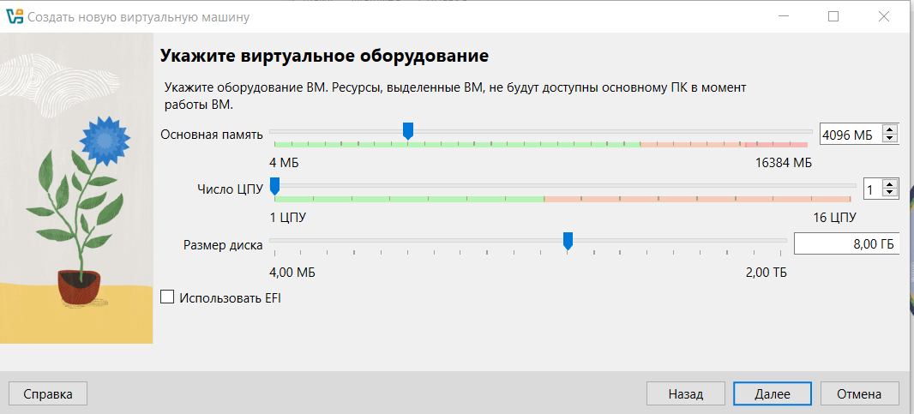

# Лабораторная работа 1. Установка виртуальной машины и Ubuntu на Windows
# Студент: Gachayev Dmitrii, I2302
# Дата выполнения: 20.09.2025

---

# Установка VirtualBox

Загружаю установщик VirtualBox с официального сайта, принимаю соглашение, завершаю установку.


# Загрузка ISO-образа Ubuntu

Загружаю Ubuntu Desktop с официиального сайта.


# Создание виртуальной машины

Создаю виртуальную машину, выбираю тип и версию, выделяю оперативную память и память для жесткого диска




# Настройка виртуальной машины

Выделяю 4 ядра, увеличиваю видеопамять до 128MB, в разделе носители выбираю скачанный заранее ISO-файл


# Установка Ubuntu

Запускаю виртуальную машину, прохожу все этапы установки Ubuntu, создаю пользователя, задаю пароль, завершаю установку


# Установка Guest Additions

Устанавливаю Guest Additions, в консоли вышедшей папки прописываю:

    ```bash
    sudo apt update 
    sudo apt install -y build-essential dkms linux-headers-$(uname -r) 
    cd /media/$USER/VBox_GAs_* 
    sudo ./VBoxLinuxAdditions.run 
    sudo reboot
    ```


