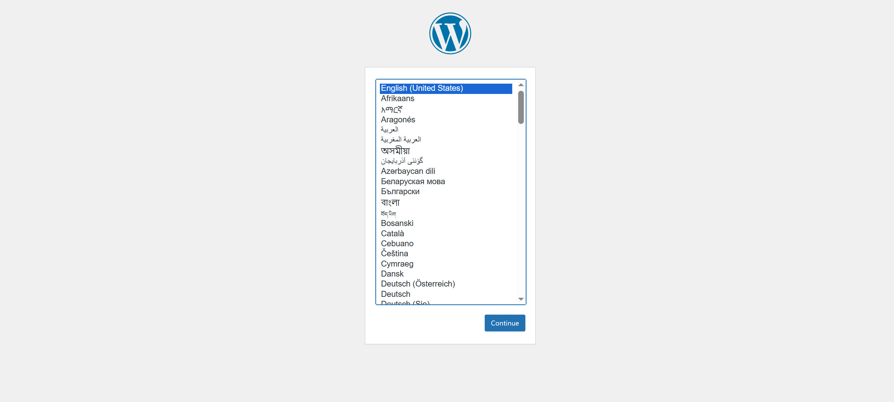
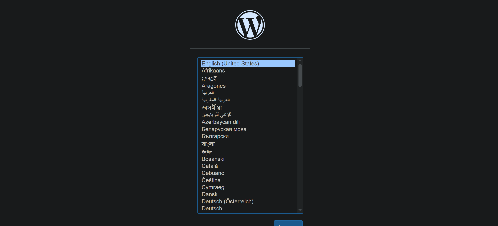

# Лабораторная работа 4.
# Студент: Gachayev Dmitrii, I2302
# Задача
Автоматизировать установку Docker и развертывание многоконтейнерного приложения WordPress + MySQL с помощью Ansible

---

## Плейбук install_docker.yml для автоматизированной установки Docker на всех хостах в группе "docker_hosts".

Создаю такой файл:
```bash
---
- name: Install Docker Engine and Docker Compose plugin
  hosts: docker_hosts
  become: yes

  vars:
    docker_user: vboxuser

  tasks:
    - name: Install required packages
      ansible.builtin.apt:
        name:
          - ca-certificates
          - curl
          - gnupg
          - lsb-release
        state: present
        update_cache: yes

    - name: Add Docker GPG apt key
      ansible.builtin.apt_key:
        url: https://download.docker.com/linux/ubuntu/gpg
        state: present

    - name: Add Docker APT repository
      ansible.builtin.apt_repository:
        repo: "deb [arch=amd64] https://download.docker.com/linux/ubuntu {{ ansible_distribution_release }} stable"
        state: present
        filename: docker

    - name: Install Docker Engine and plugins
      ansible.builtin.apt:
        name:
          - docker-ce
          - docker-ce-cli
          - containerd.io
          - docker-buildx-plugin
          - docker-compose-plugin
        state: present
        update_cache: yes

    - name: Ensure Docker service is running and enabled
      ansible.builtin.service:
        name: docker
        state: started
        enabled: yes

    - name: Add user to docker group
      ansible.builtin.user:
        name: "{{ docker_user }}"
        groups: docker
        append: yes
```
Он установит необходимые системные пакеты, добавит официальный репозиторий Docker для Ubuntu, установит и запустит Docker.

Далее запускаю этот плейбук:
```bash
sudo ansible-playbook playbook/install_docker.yml
```

Плейбук выполняется без ошибок:
```bash
PLAY [Install Docker Engine and Docker Compose plugin] *****************************************************************

TASK [Gathering Facts] *************************************************************************************************
ok: [localhost]

TASK [Install required packages] ***************************************************************************************
ok: [localhost]

TASK [Add Docker GPG apt key] ******************************************************************************************
changed: [localhost]

TASK [Add Docker APT repository] ***************************************************************************************
changed: [localhost]

TASK [Install Docker Engine and plugins] *******************************************************************************
changed: [localhost]

TASK [Ensure Docker service is running and enabled] ********************************************************************
ok: [localhost]

TASK [Add user to docker group] ****************************************************************************************
changed: [localhost]

PLAY RECAP *************************************************************************************************************
localhost                  : ok=7    changed=4    unreachable=0    failed=0    skipped=0    rescued=0    ignored=0
```

Проверяю работу Docker:
```
~/ansible-lab2$ docker --version
Docker version 29.1.1, build 0aedba5
~/ansible-lab2$ docker compose version
Docker Compose version v2.40.3
```

## Docker Compose файла для многоконтейнерного приложения

На хосте создаю следующий `docker-compose.yml`:
```dockerfile
version: "3.9"

services:
  db:
    image: mysql:8.0
    restart: unless-stopped
    environment:
      MYSQL_DATABASE: wordpress
      MYSQL_USER: wordpress
      MYSQL_PASSWORD: wordpress
      MYSQL_ROOT_PASSWORD: rootpassword
    volumes:
      - db_data:/var/lib/mysql
    networks:
      - wp_net

  wordpress:
    image: wordpress:latest
    restart: unless-stopped
    ports:
      - "8082:80"
    environment:
      WORDPRESS_DB_HOST: db:3306
      WORDPRESS_DB_NAME: wordpress
      WORDPRESS_DB_USER: wordpress
      WORDPRESS_DB_PASSWORD: wordpress
    depends_on:
      - db
    networks:
      - wp_net

volumes:
  db_data:

networks:
  wp_net:
```

И запускаю его:
```bash
docker compose up -d
```

Проверяю доступ к Wordpress по http://localhost:8082/


И выключаю контейнер:
```bash
docker compose down
```

## Автоматизация развертывания Docker Compose с помощью Ansible

Сначала сам переношу файл с хоста на VM:
```BASH
scp docker-compose.yml vboxuser@192.168.56.102:/home/vboxuser/ansible-lab2/
```

Создаю плейбук `deploy_compose.yml`:
```bash
---
- name: Deploy WordPress stack with Docker Compose
  hosts: docker_hosts
  become: yes

  vars:
    compose_dest_dir: /opt/wordpress

  tasks:
    - name: Ensure destination directory exists
      ansible.builtin.file:
        path: "{{ compose_dest_dir }}"
        state: directory
        mode: "0755"

    - name: Copy docker-compose.yml
      ansible.builtin.copy:
        src: ../docker-compose.yml
        dest: "{{ compose_dest_dir }}/docker-compose.yml"
        mode: "0644"

    - name: Run docker compose up -d
      ansible.builtin.command: docker compose up -d
      args:
        chdir: "{{ compose_dest_dir }}"

    - name: Check running containers
      ansible.builtin.command: docker ps
      register: docker_ps

    - name: Show docker ps output
      ansible.builtin.debug:
        msg: "{{ docker_ps.stdout_lines }}"
```

И запускаю его:
```bash
 sudo ansible-playbook playbook/deploy_compose.yml
```

Спустя несколько правок и ошибок получаю положительный вывод:
```bash

PLAY [Deploy WordPress stack with Docker Compose] **********************************************************************

TASK [Gathering Facts] *************************************************************************************************
ok: [localhost]

TASK [Ensure destination directory exists] *****************************************************************************
ok: [localhost]

TASK [Copy docker-compose.yml] *****************************************************************************************
ok: [localhost]

TASK [Run docker compose up -d] ****************************************************************************************
changed: [localhost]

TASK [Check running containers] ****************************************************************************************
changed: [localhost]

TASK [Show docker ps output] *******************************************************************************************
ok: [localhost] => {
    "msg": [
        "CONTAINER ID   IMAGE              COMMAND                  CREATED         STATUS         PORTS                                     NAMES",
        "7fb9412ab21c   wordpress:latest   \"docker-entrypoint.s…\"   5 minutes ago   Up 5 minutes   0.0.0.0:8082->80/tcp, [::]:8082->80/tcp   wordpress-wordpress-1",
        "490b3e3b0e27   mysql:8.0          \"docker-entrypoint.s…\"   5 minutes ago   Up 5 minutes   3306/tcp, 33060/tcp                       wordpress-db-1"
    ]
}

PLAY RECAP *************************************************************************************************************
localhost                  : ok=6    changed=2    unreachable=0    failed=0    skipped=0    rescued=0    ignored=0
```

Проверяю что сайт запущен через хост по http://192.168.56.102:8082



Сайт работает.

# Вывод
Docker и Docker Compose успешно установлены, compose-файл корректно перенесён и развернут на виртуальной машине, контейнеры WordPress и MySQL запускаются и доступны по сети, что подтверждает успешное выполнение всей автоматизации.