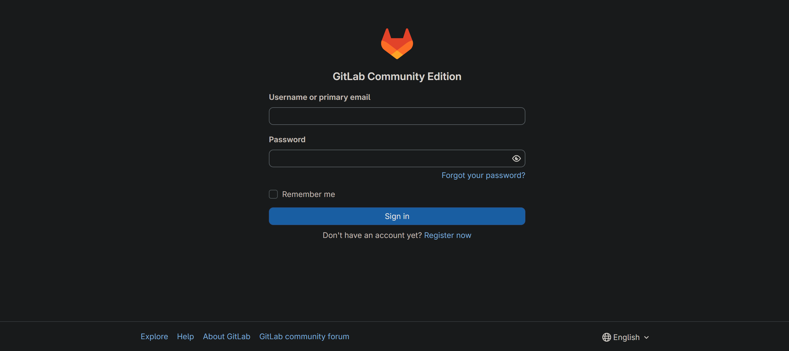
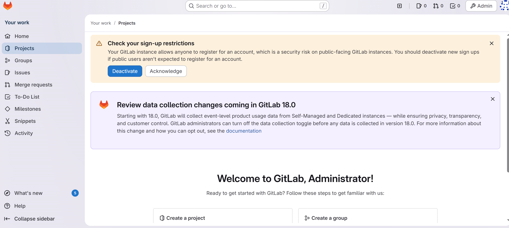
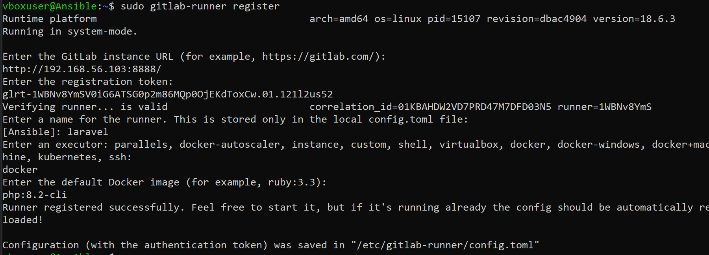
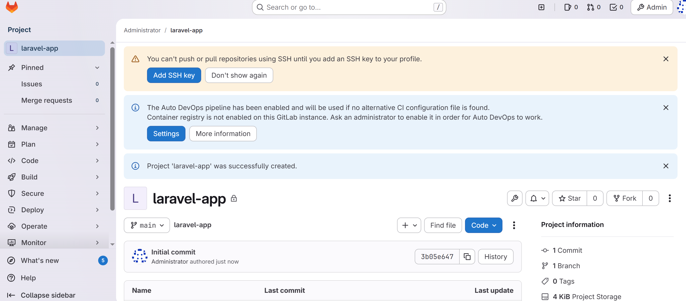
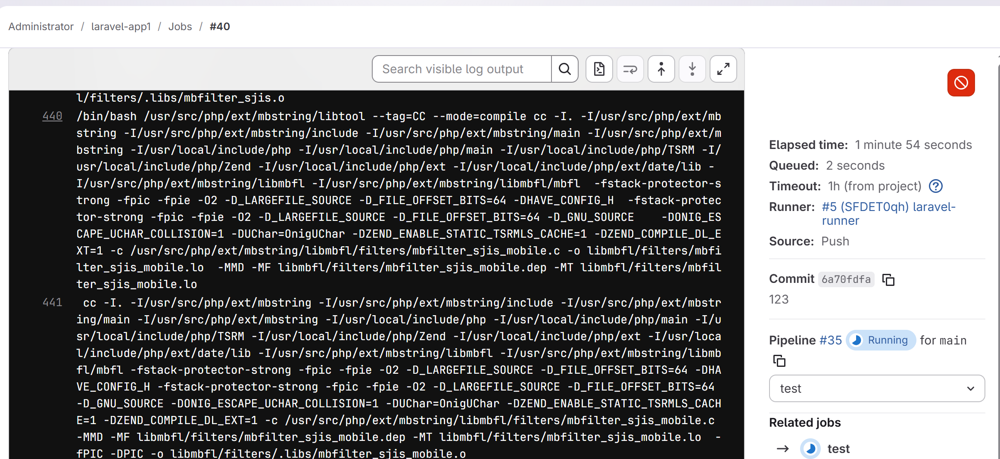
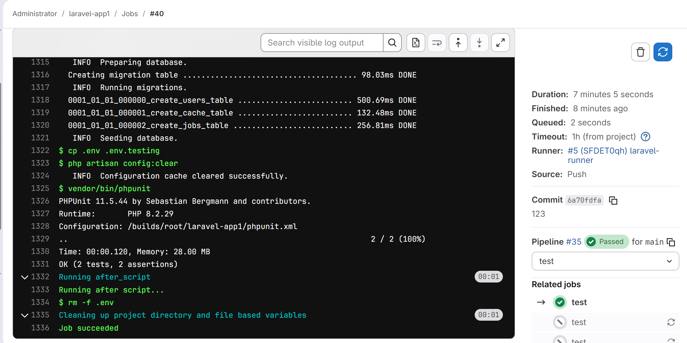
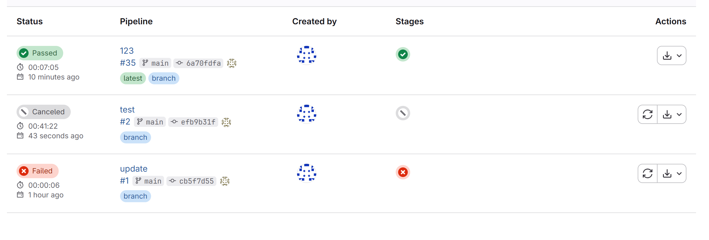

# Лабораторная работа 5.
# Студент: Gachayev Dmitrii, I2302
# Задача
Развернуть GitLab CE, подключить GitLab Runner, загрузить Laravel-проект в репозиторий и запустить CI-конвейер для прогона тестов через PHPUnit.

---

## 1. Развертывание GitLab CE
Выполняю такую команду с IP моей виртуалки (поменял порты так как 80 у меня занят):
```bash
sudo docker run -d \
  --hostname 192.168.56.103 \
  -p 8888:80 \
  -p 5443:443 \
  -p 8022:22 \
  --name gitlab \
  -e GITLAB_OMNIBUS_CONFIG="external_url='http://192.168.56.103:8888'; gitlab_rails['gitlab_shell_ssh_port']=8022" \
  -v gitlab-data:/var/opt/gitlab \
  -v ~/gitlab-config:/etc/gitlab \
  gitlab/gitlab-ce:latest
```

После выполнения команды жду и проверяю http://192.168.56.103:8888, вижу рабочий сайт:



Вхожу под root:



## 2. Настройка Runner

Устанавливаю GitLab Runner:
  ```bash
  curl -L "https://packages.gitlab.com/install/repositories/runner/gitlab-runner/script.deb.sh" | sudo bash
  sudo apt-get install -y gitlab-runner
  ```

Регистрирую Runner:



Запускаю его:
```bash
gitlab-runner run
```

Все запускается успешно:
```bash
vboxuser@Ansible:~$ sudo gitlab-runner status
[sudo] password for vboxuser:
Runtime platform                                    arch=amd64 os=linux pid=16010 revision=dbac4904 version=18.6.3
gitlab-runner: Service is running
vboxuser@Ansible:~$
```

## 3. Создание проекта и репозитория в GitLab
Создаю проект на GitLab:



Клонирую его в виртуальную машину:
```bash
git clone http://192.168.56.103:8888/root/laravel-app1.git ~/laravel-app
```

Качаю Laravel-проект в другую папку и копирую содержимое с папку с проектом
```bash
cp laravel/* laravel-app/ -r
```

Заливаю всё на GitLab репозиторий:
```bash
git add .
git commit -m ""
git push
```

## 4. Запуск и проверка конвейера

Перехожу в CI/CD > Pipelines и вижу Running Job



Спустя время он становится Passed, что означает что тесты проходят:



История пайплайнов:



# Вывод
GitLab успешно развернут, Runner установлен и зарегистрирован, проект загружен в репозиторий, пайплайн запускается и проходит тесты.